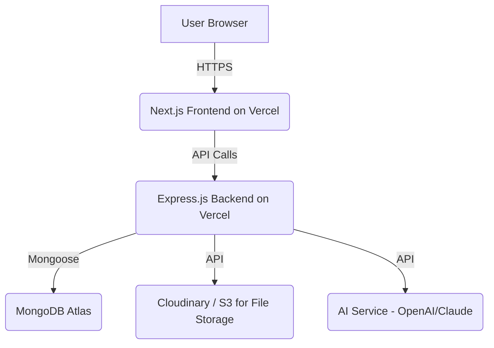

# System Architecture

This document outlines the high-level architecture for the EduSmart LMS.

## Frontend
- **Framework:** Next.js (React)
- **Styling:** Tailwind CSS
- **State Management:** React Context / TanStack Query
- **Deployment:** Vercel

## Backend
- **Framework:** Node.js / Express.js
- **Database:** MongoDB (via Mongoose)
- **Authentication:** JWT (JSON Web Tokens)
- **Deployment:** Vercel

## File Storage
- **Service:** Cloudinary or AWS S3
- **Usage:** Storing video lessons, PDF materials, and assignment submissions.

## Diagram (Mermaid Syntax)

